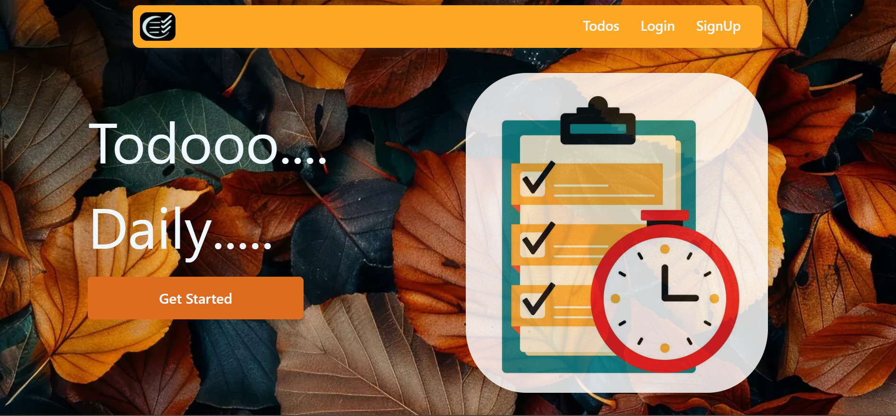
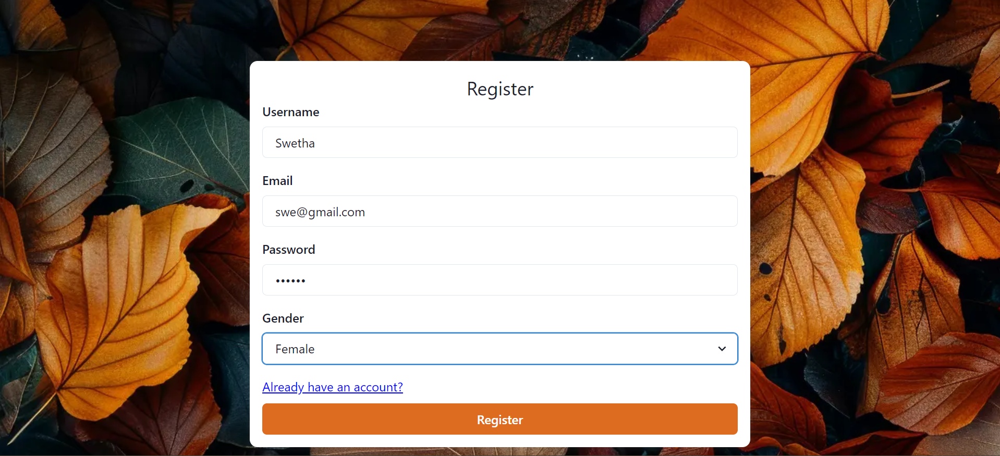
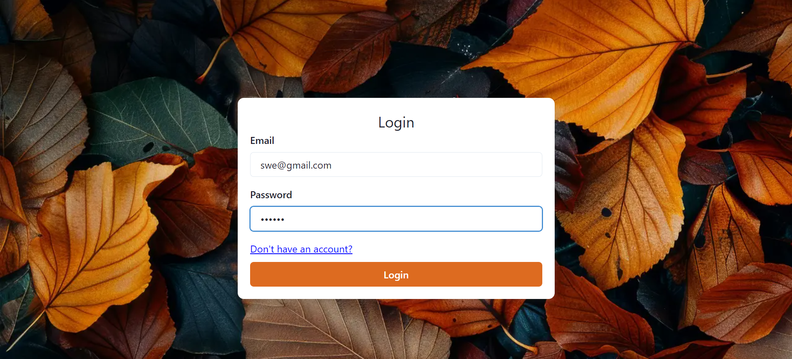
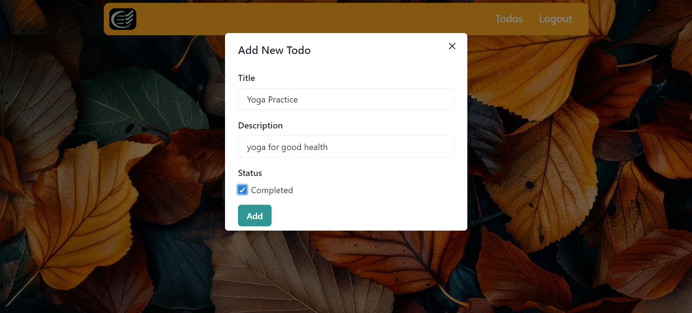
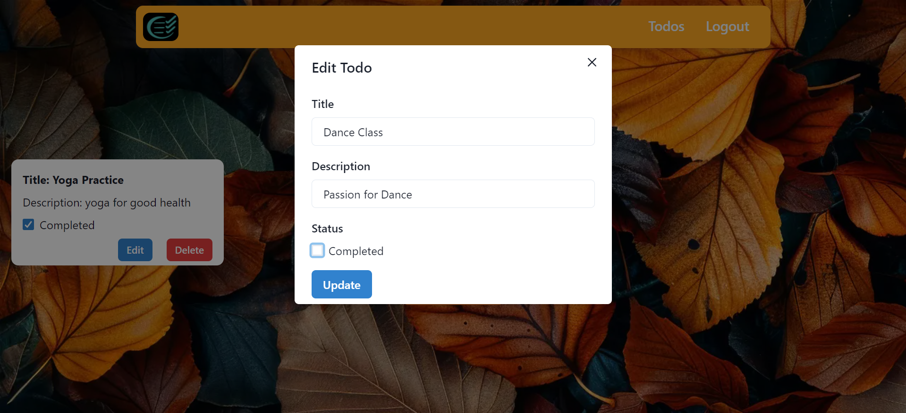

# Todo Daily

## About the Todo Daily

The Todo Daily is a simple and intuitive application that allows users to keep track of their tasks and manage their daily activities efficiently. It features a user-friendly interface where tasks can be added, edited, and deleted with ease. The app is designed to help users stay organized and improve their productivity. Additionally, the app is fully responsive, ensuring a seamless experience across various devices, including desktops, tablets, and mobile phones.

## Features

- **Add Tasks**: Quickly add new tasks with a title and description.
- **Edit Tasks**: Modify existing tasks to keep them up to date.
- **Delete Tasks**: Remove tasks that are no longer needed.
- **Task Management**: Mark tasks as completed or pending.
- **Responsive Design**: Enjoy a seamless experience on any device, from desktops to mobile phones.
- **User Authentication**:
  - **Signup**: Create a new account with email and password.
  - **Login**: Access your account to manage your tasks.
  - **Logout**: Securely log out of your account when done.

## Tech Stack

This application utilizes both frontend and backend technologies to deliver a full-featured task management solution:

### Frontend

- **React**: Used for building the user interface.
- **Chakra UI**: For styling components and ensuring a responsive design.
- **Axios**: For making HTTP requests to the backend.
- **@chakra-ui/react**: A simple, modular, and accessible component library that gives you the building blocks to build your React applications.
- **@emotion/react** & **@emotion/styled**: Libraries for writing CSS styles with JavaScript, providing powerful styling capabilities.
- **axios**: A promise-based HTTP client for the browser and Node.js, used for making API requests.
- **framer-motion**: A motion library for React that provides animations and transitions.
- **react**: The core library for building user interfaces.
- **react-dom**: Serves as the entry point of the DOM-related rendering paths.
- **react-router-dom**: A collection of navigational components that compose declaratively with your application.

### Backend

- **Node.js**: Handles server-side operations.
- **Express**: Manages routing and middleware.
- **MongoDB**: A NoSQL database used for storing tasks.
- **Mongoose**: An Object Data Modeling (ODM) library for MongoDB and Node.js.
- **JWT**: For user authentication and securing API endpoints.
- **bcrypt**: A library to help hash passwords, providing security for user credentials.
- **colors**: Adds color and styling options to the console outputs, useful for debugging.
- **cors**: A middleware package that allows cross-origin requests, enabling the frontend to communicate with the backend server from different origins.
- **dotenv**: Loads environment variables from a `.env` file into `process.env`, used for storing sensitive configuration information.
- **express**: A fast, unopinionated, minimalist web framework for Node.js, used to create APIs.
- **mongoose**: Provides a straightforward, schema-based solution to model application data and interact with MongoDB.
- **morgan**: HTTP request logger middleware for Node.js, helpful for logging requests made to the server.

## Snapshots

Below are some snapshots of the Todo App showcasing its interface and functionality:

1. **Home Screen**: Displays a list of tasks with options to add, edit, or delete them.
   

2. **Signup**: User registration form for creating a new account.
   

3. **Login**: User login form for accessing the app.
   

4. **Add Task**: A form for creating a new task with fields for title and description.
   

5. **Edit Task**: Allows users to modify details of an existing task.
   

6. **Task Management**: Interface showing completed and pending tasks with filtering options.
   

## Links

- [Deployed Project](https://todomadeeasy.netlify.app)
- [Backend Repository](https://github.com/Swethas2005/Todo-Backend)

Feel free to provide feedback!
